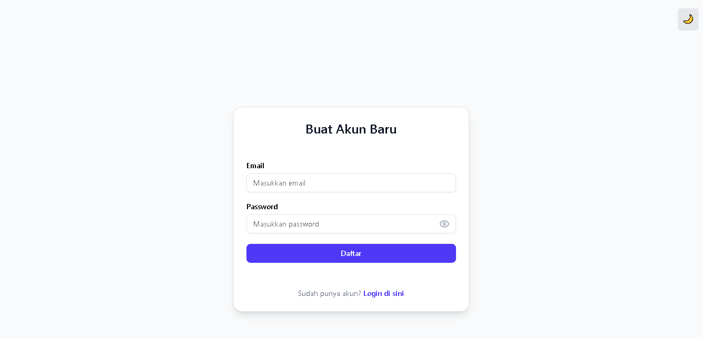
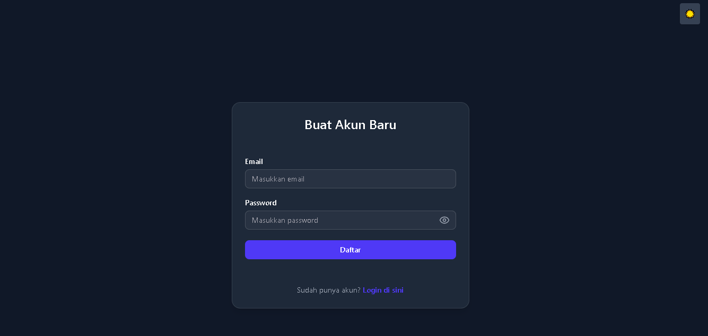
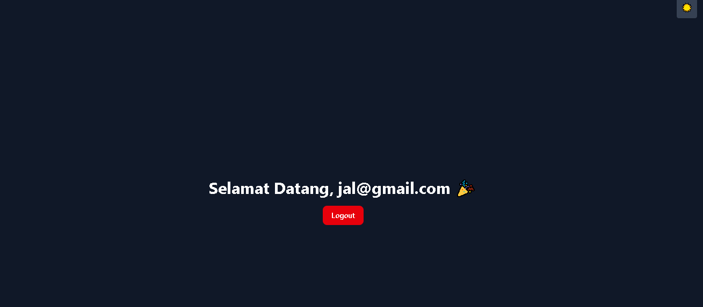
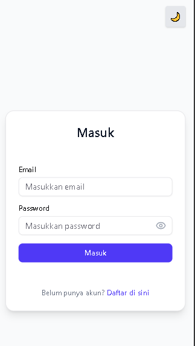
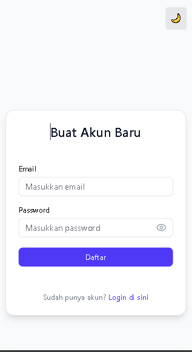

# Web Programmer Challenge - Meliana

Repository ini berisi project **frontend** dari Web Programmer Challenge. Project ini menggunakan **React.js**, **Tailwind CSS**, dan beberapa library modern untuk membangun form login, dashboard, dan komponen UI lainnya.

---

## 📂 Tech Stack
1. **Frontend**
- **React.js** 
- **Tailwind CSS** 
- **React Hook Form** 
- **Zustand** 
- **React Router DOM** 
- **Axios** 
- **Shadcn UI & Radix UI** 
- **Lucide React**
2. **Backend** 
- **bcrypt**
- **cookie-parser**
- **cors**
- **express**
- **jsonwebtoken**

## ⚡ Cara Menjalankan Project
1. Clone repository:
```bash
git clone https://github.com/Meliana1020/web-probrammer-challange-meliana.git
2. Masuk ke folder frontend
```bash
cd frontend
3. Install Dependensi
```bash
npm install
4. Jalankan development server
```bash
npm run dev
5. Buka Browser
```bash
http://localhost:5173
6. Masuk folder backend
```bash
cd backend
7. Install dependensi
```bash
npm install
8. Jalankan server
```bash
node server.js

## ⚡ Arsitektur Sistem

Frontend (React + Vite)
│
├─ src
│   ├─ components/       
│   ├─ store/              
│   ├─ pages/
│   ├─ router/               
│   └─ App.jsx            
│
├─ .babelrc
├─ jest.config.cjs
├─ jsconfig.json
├─ package-lock.json
├─ package.json
└─ vite.config.js

Backend (Node.js)
│
├─ config
├─ controllers
├─ middleware 
├─ routes/             
└─ server.js                


🖼️ Screenshot Tampilan UI

### Desktop

1. Login Page 
     

2. **Register Page**
   - **Light Mode**  
       
   - **Dark Mode**  
       

3. **Dashboard Page**  
     

### Mobile

1. **Login Page**  
     

2. **Register Page**  
     


